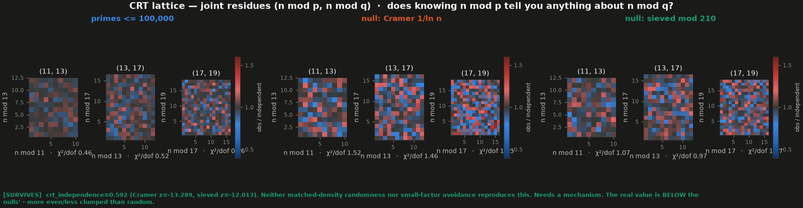
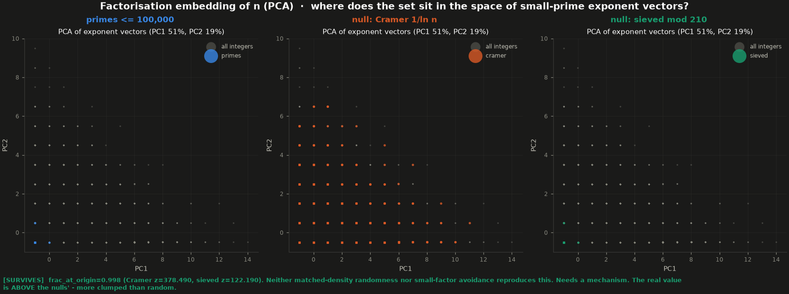
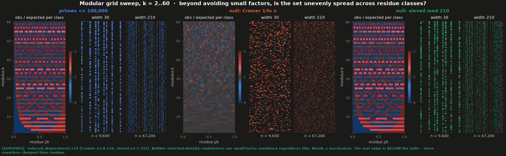
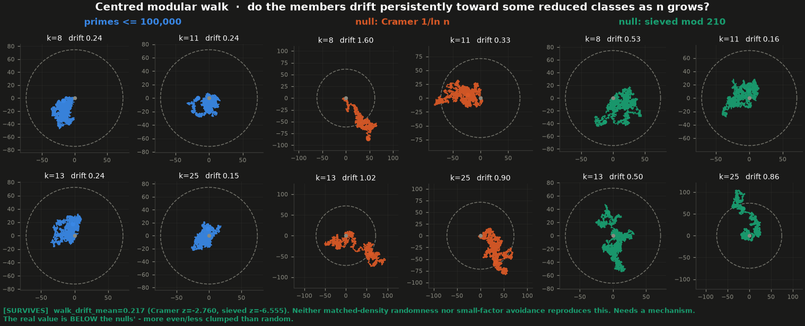
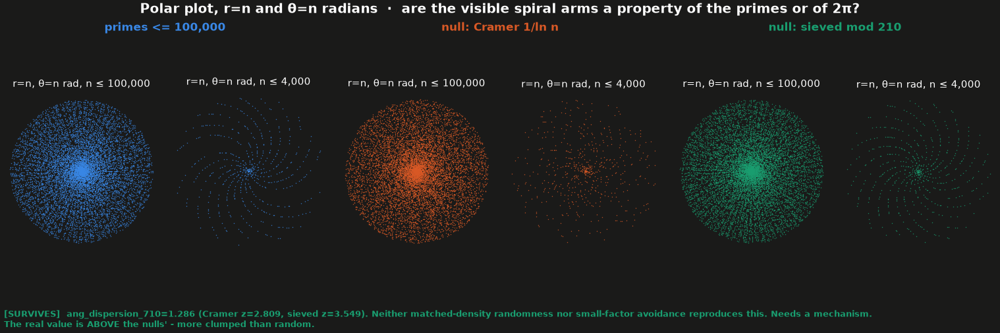
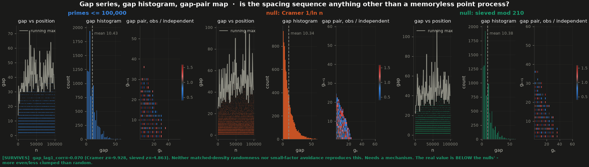
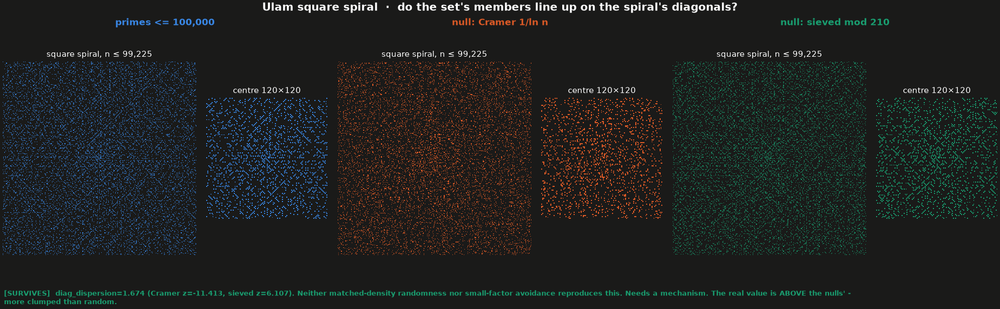
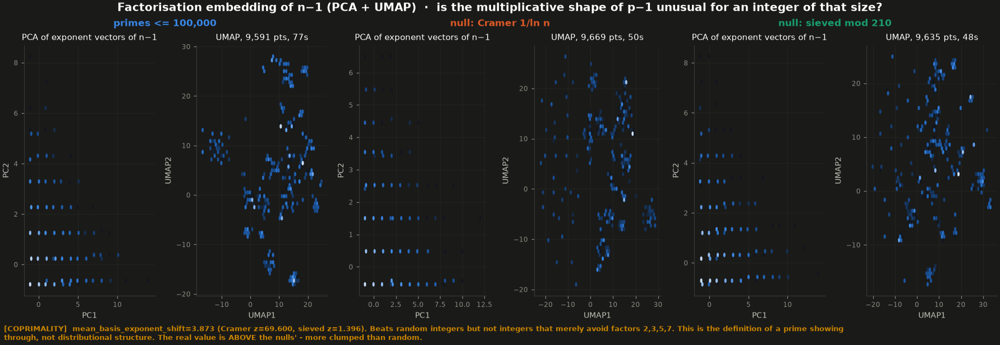
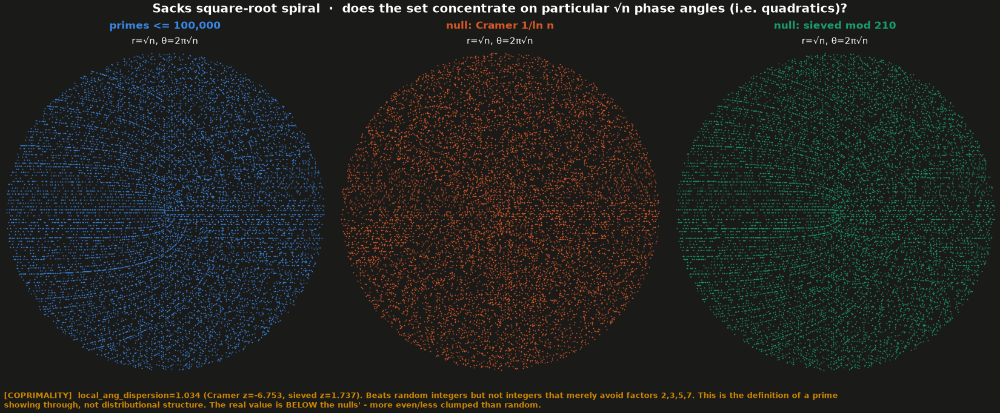

# Iteration 1

`N = 100,000`  ·  seed `0`  ·  12 null replicates per model ·  200s

| set | count | density |
|---|---|---|
| primes <= 100,000 | 9,592 | 0.09592 |
| null: Cramer 1/ln n | 9,670 | 0.09670 |
| null: sieved mod 210 | 9,636 | 0.09636 |

Verdicts are on the headline statistic, z measured against an ensemble of independent null draws. `SURVIVES` = separates from both nulls. `COPRIMALITY` = separates from Cramér only, i.e. it is small-factor avoidance. `ARTIFACT` = both nulls reproduce it.

| verdict | representation | headline | real | z vs Cramér | z vs sieved |
|---|---|---|---|---|---|
| **SURVIVES** | `crt_lattice` | crt_independence | 0.592 | -13.289 | -12.013 |
| **SURVIVES** | `factor_embed` | frac_at_origin | 0.998 | 378.490 | 122.190 |
| **SURVIVES** | `modular_grid` | reduced_dispersion | 0.134 | -8.516 | -7.331 |
| **SURVIVES** | `modular_walk` | walk_drift_mean | 0.217 | -2.760 | -6.555 |
| **SURVIVES** | `polar_radian` | ang_dispersion_710 | 1.286 | 2.809 | 3.549 |
| **SURVIVES** | `prime_gaps` | gap_lag1_corr | -0.070 | -9.928 | -4.863 |
| **SURVIVES** | `ulam_spiral` | diag_dispersion | 1.674 | -11.413 | 6.107 |
| **COPRIMALITY** | `factor_shift` | mean_basis_exponent_shift | 3.873 | 69.600 | 1.396 |
| **COPRIMALITY** | `sacks_spiral` | local_ang_dispersion | 1.034 | -6.753 | 1.737 |

## CRT lattice — joint residues (n mod p, n mod q)  ·  SURVIVES

*does knowing n mod p tell you anything about n mod q?*

**Critique.** SURVIVES - crt_independence=0.592 (Cramer z=-13.289, sieved z=-12.013). Neither matched-density randomness nor small-factor avoidance reproduces this. Needs a mechanism. The real value is BELOW the nulls' - more even/less clumped than random.

**Reading the picture.** Grey means the cell holds exactly what independence predicts. A value of χ²/dof near 1 means the two residues carry no information about each other; the picture being visibly speckled at this sample size is expected — roughly 10 members per cell — and is noise, not texture. Compare the reduced statistic with `crt_independence_unreduced` to see how much a naive version of this test would have been driven by the empty row and column alone.

**Why it happens.** Any dependence would mean the members are not spread across residue classes mod pq the way they are spread mod p and mod q separately.

| statistic | real | Cramér mean±sd | z | sieved mean±sd | z |
|---|---|---|---|---|---|
| `crt_independence` | 0.592 | 1.562±0.073 | -13.289 | 1.014±0.035 | -12.013 |
| `crt_independence_max` | 0.756 | 1.697±0.089 | -10.543 | 1.114±0.053 | -6.803 |
| `crt_independence_unreduced` | 0.392 | 0.908±0.048 | -10.784 | 0.586±0.016 | -12.166 |
| `crt_indep_11_13` | 0.458 | 1.529±0.156 | -6.879 | 0.950±0.116 | -4.240 |
| `crt_indep_13_17` | 0.525 | 1.582±0.122 | -8.687 | 1.057±0.083 | -6.410 |

## Factorisation embedding of n (PCA)  ·  SURVIVES

*where does the set sit in the space of small-prime exponent vectors?*

**Critique.** SURVIVES - frac_at_origin=0.998 (Cramer z=378.490, sieved z=122.190). Neither matched-density randomness nor small-factor avoidance reproduces this. Needs a mechanism. The real value is ABOVE the nulls' - more clumped than random.

**Reading the picture.** Read the axes before the pattern: the coordinates are 'how many times does 2, 3, 5 ... divide n'. Almost every prime is at the origin because none of them do — the primes panel is one coloured dot. Note the disagreement between eye and statistic here, in the direction people usually assume is impossible: the *picture* cannot tell the primes from the sieved null (both collapse to the origin, since PC1 and PC2 are essentially the exponents of 2 and 3, which both sets have set to zero), while the *statistic* separates them at z = 122. Neither is wrong; they are answering different questions, and the statistic's question happens to be a tautology.

**Why it happens.** Tautological, and worth stating plainly so it is not mistaken for a finding: the embedding's coordinates are divisibility by the primes up to 71, and a prime above 71 is divisible by none of them, so it maps to the zero vector by definition. `frac_at_origin` ≈ 1 for the primes is a restatement of what a prime is. It separates from the sieved null only because that null is sieved at 7, not at 71 -- a deeper null (integers with no factor below 71) would erase this entirely.

| statistic | real | Cramér mean±sd | z | sieved mean±sd | z |
|---|---|---|---|---|---|
| `frac_at_origin` | 0.998 | 0.127±0.0023 | 378.490 | 0.556±0.00362 | 122.190 |
| `mean_basis_exponent` | 0.00209 | 2.510±0.00756 | -331.615 | 0.596±0.00465 | -127.693 |
| `mean_v2` | 0.000104 | 0.996±0.010 | -96.138 | 0.000104±7.83e-07 | 0.00813 |

## Modular grid sweep, k = 2..60  ·  SURVIVES

*beyond avoiding small factors, is the set unevenly spread across residue classes?*

**Critique.** SURVIVES - reduced_dispersion=0.134 (Cramer z=-8.516, sieved z=-7.331). Neither matched-density randomness nor small-factor avoidance reproduces this. Needs a mechanism. The real value is BELOW the nulls' - more even/less clumped than random.

**Reading the picture.** In the sweep, black = a residue class the set never occupies, grey = exactly the expected share, red = enriched. The banded triangle is the divisibility pattern. The headline statistic throws that pattern away: it looks only at classes coprime to k, counts candidates from the integers coprime to 210, and applies the binomial (1−ρ) correction — so 1.0 means 'no better spread than a random choice of that many candidates', and anything well below 1 means the set is *more* even than random.

**Why it happens.** Two separate things live in this picture. The dark columns are trivial: a class j mod k with gcd(j,k) = d > 1 contains only multiples of d, so it holds no primes past d itself. The headline number is not that — it is the spread across the classes that are allowed, and for the primes it comes out far *below* random. The primes' counts in the reduced classes mod k sit within a few units of dead level where a random set of the same size would scatter by ±√count. The reason is that the primes are one fixed set, not a sample: their counting error in each progression is a single slowly-growing quantity of order √N, shared out over the φ(k) classes, instead of independent per-class sampling noise of order √(count) each. At N=10⁵ that is roughly a threefold smaller deviation, i.e. an order of magnitude in χ².

| statistic | real | Cramér mean±sd | z | sieved mean±sd | z |
|---|---|---|---|---|---|
| `reduced_dispersion` | 0.134 | 1.110±0.115 | -8.516 | 0.864±0.100 | -7.331 |
| `max_reduced_dispersion` | 0.375 | 2.499±0.508 | -4.180 | 1.815±0.559 | -2.575 |
| `reduced_dispersion_allint_pool` | 0.077 | 0.799±0.085 | -8.478 | 0.501±0.057 | -7.442 |
| `all_class_dispersion` | 455.493 | 0.829±0.050 | 9.03e+03 | 443.473±3.358 | 3.579 |
| `reduced_dispersion_k12` | 0.151 | 0.874±0.436 | -1.659 | 0.723±0.548 | -1.044 |
| `reduced_dispersion_k30` | 0.056 | 0.701±0.415 | -1.554 | 0.760±0.336 | -2.094 |
| `reduced_dispersion_k47` | 0.276 | 1.652±0.221 | -6.228 | 0.939±0.138 | -4.810 |

## Centred modular walk  ·  SURVIVES

*do the members drift persistently toward some reduced classes as n grows?*

**Critique.** SURVIVES - walk_drift_mean=0.217 (Cramer z=-2.760, sieved z=-6.555). Neither matched-density randomness nor small-factor avoidance reproduces this. Needs a mechanism. The real value is BELOW the nulls' - more even/less clumped than random.

**Reading the picture.** The dashed circle is the distance an ordinary random walk of that many steps would typically reach, so it is the drift = 1 contour and every panel is readable on its own terms despite the differing axis scales. A path that fills its circle and ends near the rim is equidistribution; one that sets off in a straight line past it is a persistent bias; one that stays huddled well inside — which is what the primes do — is a set spread *more* evenly than chance.

**Why it happens.** A drift *above* 1 would be a bias among the classes coprime to k — the set preferring some reduced residues by an amount that does not wash out as n grows. A drift well *below* 1, which is what the primes give, is the opposite: the walk keeps returning to the origin because the residues are spread more evenly than chance would spread them. It is the same hyper-evenness the modular sweep measures, seen as a path instead of a histogram.

| statistic | real | Cramér mean±sd | z | sieved mean±sd | z |
|---|---|---|---|---|---|
| `drift_k8` | 0.242 | 0.756±0.294 | -1.748 | 0.806±0.446 | -1.265 |
| `drift_k9` | 0.193 | 0.812±0.585 | -1.057 | 0.881±0.447 | -1.540 |
| `drift_k11` | 0.235 | 0.849±0.395 | -1.556 | 0.870±0.427 | -1.488 |
| `drift_k13` | 0.242 | 1.061±0.522 | -1.570 | 0.789±0.345 | -1.587 |
| `drift_k16` | 0.102 | 0.793±0.544 | -1.269 | 0.814±0.500 | -1.424 |
| `drift_k25` | 0.152 | 1.235±0.717 | -1.512 | 0.984±0.547 | -1.520 |
| `drift_k29` | 0.349 | 0.940±0.547 | -1.082 | 0.815±0.379 | -1.229 |
| `walk_drift_mean` | 0.217 | 0.921±0.255 | -2.760 | 0.851±0.097 | -6.555 |
| `walk_drift_max` | 0.349 | 1.677±0.525 | -2.528 | 1.516±0.267 | -4.367 |

## Polar plot, r=n and θ=n radians  ·  SURVIVES

*are the visible spiral arms a property of the primes or of 2π?*

**Critique.** SURVIVES - ang_dispersion_710=1.286 (Cramer z=2.809, sieved z=3.549). Neither matched-density randomness nor small-factor avoidance reproduces this. Needs a mechanism. The real value is ABOVE the nulls' - more clumped than random.

**Reading the picture.** Arm counts 6, 44 and 710 are the denominators you get when you approximate 2π by a fraction; 100 is a non-resonant control. Dispersion is measured against the number of candidate integers per angular bin, so a set that is simply 'some integers' scores ~1 no matter how striking the picture looks. The `_allint` variants use all integers as candidates: at 710 bins they read ≈21 for the primes and ≈21 for the sieved null alike, a twentyfold 'signal' that is entirely the even bins being empty. Instructive as a demonstration of how easily a statistic can be manufactured out of nothing.

**Why it happens.** The spokes themselves are nothing about the primes: with 2π ≈ 44/7 ≈ 710/113, integers one apart land at angles that nearly repeat after 44 or 710 steps, so *any* set of integers is drawn onto them. The picture is of the continued-fraction expansion of 2π, and the statistic agrees — at 6, 44 and 100 bins the primes match the sieved null within z≈1. The one bin count that does separate, 710, separates for a reason that is still not about distribution: 710 = 2·5·71, and because 113/710 ≈ 1/2π the bin index is essentially n mod 710, so ten of the 710 bins are the classes divisible by 71. The primes vacate those ten bins; the sieved null, which only knows about factors up to 7, does not. That accounts for an excess of about 0.3 in χ²/dof, which is the whole of the observed gap. It is a measurement of the null's sieve bound, not of the primes.

| statistic | real | Cramér mean±sd | z | sieved mean±sd | z |
|---|---|---|---|---|---|
| `ang_dispersion_allint_6` | 0.597 | 0.985±0.554 | -0.701 | 0.449±0.238 | 0.620 |
| `ang_dispersion_6` | 0.699 | 1.610±0.623 | -1.463 | 0.715±0.453 | -0.035 |
| `ang_dispersion_allint_44` | 2.093 | 0.804±0.196 | 6.582 | 1.733±0.260 | 1.384 |
| `ang_dispersion_44` | 1.159 | 2.899±0.309 | -5.625 | 1.033±0.175 | 0.718 |
| `ang_dispersion_allint_100` | 2.984 | 0.844±0.120 | 17.872 | 3.247±0.208 | -1.263 |
| `ang_dispersion_100` | 1.184 | 6.005±0.579 | -8.327 | 1.027±0.140 | 1.123 |
| `ang_dispersion_allint_710` | 20.999 | 0.908±0.041 | 491.644 | 20.830±0.169 | 1.004 |
| `ang_dispersion_710` | 1.286 | 1.112±0.062 | 2.809 | 0.985±0.085 | 3.549 |

## Gap series, gap histogram, gap-pair map  ·  SURVIVES

*is the spacing sequence anything other than a memoryless point process?*

**Critique.** SURVIVES - gap_lag1_corr=-0.070 (Cramer z=-9.928, sieved z=-4.863). Neither matched-density randomness nor small-factor avoidance reproduces this. Needs a mechanism. The real value is BELOW the nulls' - more even/less clumped than random.

**Reading the picture.** The third panel divides the observed (gₖ, gₖ₊₁) table by what it would be if consecutive gaps were independent, so grey is 'no memory' and any coloured cell is a gap pair that happens more or less often than chance. The histogram's spikes at multiples of 6 are the thing to be suspicious of.

**Why it happens.** Consecutive members that are all odd force every gap even, and members avoiding 3 as well push gaps toward multiples of 6 -- both are consequences of small-factor avoidance, and a null with the same avoidance shows the same spikes. Any lag-1 correlation beyond that would be genuine memory.

| statistic | real | Cramér mean±sd | z | sieved mean±sd | z |
|---|---|---|---|---|---|
| `gap_var_ratio` | 0.592 | 0.927±0.024 | -13.740 | 0.654±0.00792 | -7.830 |
| `gap_lag1_corr` | -0.070 | 0.013±0.00834 | -9.928 | -0.017±0.011 | -4.863 |
| `frac_gap_div6` | 0.402 | 0.125±0.00441 | 62.633 | 0.406±0.00319 | -1.228 |
| `frac_gap_even` | 1.000 | 0.475±0.00634 | 82.798 | 1.000±7.83e-07 | -0.00813 |
| `max_gap_over_mean` | 6.906 | 10.140±1.476 | -2.190 | 7.722±0.599 | -1.363 |

## Ulam square spiral  ·  SURVIVES

*do the set's members line up on the spiral's diagonals?*

**Critique.** SURVIVES - diag_dispersion=1.674 (Cramer z=-11.413, sieved z=6.107). Neither matched-density randomness nor small-factor avoidance reproduces this. Needs a mechanism. The real value is ABOVE the nulls' - more clumped than random.

**Reading the picture.** Diagonals of the square spiral are values of quadratics 4k²+bk+c; rows and columns are not, and act as an internal control — `diag_over_row` is the ratio. The headline counts candidates from the integers coprime to 210 and applies the (1−ρ) correction, so the diagonals that are empty *because they are all even* no longer contribute; `diag_dispersion_allint` is the naive version that lets them count, and the gap between the two is how much of the famous diagonal effect is just parity.

**Why it happens.** Along any diagonal of this spiral n advances by 4k+const, so n mod 2 — and for half of them n mod 3 — is fixed. Every diagonal whose fixed residue shares a factor with 2 or 3 is empty of primes and the rest absorb the density, which is the whole of the naive statistic. Once candidates are restricted to integers coprime to 210 that mechanism is spent, and what is left is the same hyper-evenness seen in the modular sweep rather than a preference for particular quadratics.

| statistic | real | Cramér mean±sd | z | sieved mean±sd | z |
|---|---|---|---|---|---|
| `diag_dispersion_allint` | 19.358 | 0.944±0.038 | 479.020 | 18.899±0.121 | 3.784 |
| `diag_dispersion` | 1.674 | 4.177±0.219 | -11.413 | 1.165±0.083 | 6.107 |
| `anti_dispersion_allint` | 17.457 | 0.920±0.062 | 266.982 | 17.025±0.110 | 3.908 |
| `anti_dispersion` | 1.627 | 1.972±0.173 | -1.996 | 1.126±0.083 | 6.070 |
| `row_dispersion_allint` | 2.402 | 1.051±0.063 | 21.538 | 2.338±0.129 | 0.494 |
| `row_dispersion` | 1.079 | 5.791±0.432 | -10.903 | 1.213±0.105 | -1.281 |
| `col_dispersion_allint` | 2.335 | 1.019±0.080 | 16.382 | 2.530±0.131 | -1.483 |
| `col_dispersion` | 1.099 | 6.120±0.434 | -11.557 | 1.248±0.123 | -1.212 |
| `diag_over_row` | 1.552 | 0.724±0.047 | 17.633 | 0.966±0.096 | 6.084 |

## Factorisation embedding of n−1 (PCA + UMAP)  ·  COPRIMALITY

*is the multiplicative shape of p−1 unusual for an integer of that size?*

**Critique.** COPRIMALITY - mean_basis_exponent_shift=3.873 (Cramer z=69.600, sieved z=1.396). Beats random integers but not integers that merely avoid factors 2,3,5,7. This is the definition of a prime showing through, not distributional structure. The real value is ABOVE the nulls' - more clumped than random.

**Reading the picture.** Both projections are log-scaled density hexbins, not scatter, because 10⁴ points overplot. PCA is dominated by the 2-adic valuation of n−1. Treat the UMAP clusters as furniture, not findings: the exponent vectors are short integer vectors with many exact duplicates, so UMAP separates them into islands of identical points, and it draws the same islands on all three panels. Cluster count and shape here are a function of n_neighbors and of the discreteness of the coordinates, not of which integers went in.

**Why it happens.** Every prime past 2 is odd, so p−1 is always even, and the density of the basis exponents shifts up accordingly. That is parity, not depth: a null whose members are already odd shows the same thing.

| statistic | real | Cramér mean±sd | z | sieved mean±sd | z |
|---|---|---|---|---|---|
| `mean_v2_of_shift` | 1.996 | 1.004±0.015 | 66.119 | 1.998±0.015 | -0.144 |
| `mean_basis_exponent_shift` | 3.873 | 2.509±0.020 | 69.600 | 3.848±0.018 | 1.396 |
| `frac_shift_div6` | 0.499 | 0.166±0.00319 | 104.344 | 0.501±0.00257 | -0.720 |
| `v2_shape_dispersion` | 1.08e+03 | 2.962±0.993 | 1.08e+03 | 1.08e+03±9.075 | -0.196 |

## Sacks square-root spiral  ·  COPRIMALITY

*does the set concentrate on particular √n phase angles (i.e. quadratics)?*

**Critique.** COPRIMALITY - local_ang_dispersion=1.034 (Cramer z=-6.753, sieved z=1.737). Beats random integers but not integers that merely avoid factors 2,3,5,7. This is the definition of a prime showing through, not distributional structure. The real value is BELOW the nulls' - more even/less clumped than random.

**Reading the picture.** Angle is 2π·frac(√n), so a quadratic n = k²+bk+c sits at a *nearly* fixed angle — it drifts by O(1/k), which is why the global binning is nearly blind and the headline uses thin radial annuli instead. Candidates are the integers coprime to 210, so a ray that exists only because its progression is all-even does not count.

**Why it happens.** frac(√n) is almost constant along k²+bk+c, so each quadratic progression is roughly one angular bin. Progressions that are identically even, or identically divisible by 3, hold no primes and the rest absorb the density — that is what the eye reads as rays, and the sieved null draws the same ones.

| statistic | real | Cramér mean±sd | z | sieved mean±sd | z |
|---|---|---|---|---|---|
| `ang_dispersion_allint_360` | 0.973 | 0.918±0.085 | 0.649 | 0.843±0.076 | 1.720 |
| `ang_dispersion_360` | 1.186 | 2.007±0.161 | -5.106 | 0.997±0.074 | 2.548 |
| `ang_dispersion_allint_720` | 1.054 | 0.903±0.045 | 3.368 | 0.899±0.051 | 3.042 |
| `ang_dispersion_720` | 1.282 | 2.103±0.105 | -7.788 | 0.996±0.053 | 5.426 |
| `local_ang_dispersion` | 1.034 | 1.964±0.138 | -6.753 | 0.969±0.037 | 1.737 |
